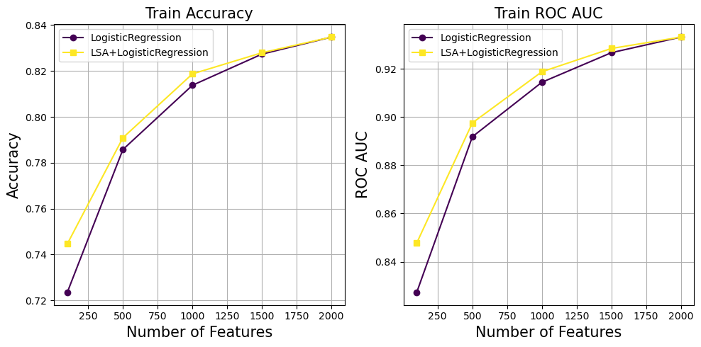

# LatentToken

This repository explores improving tokenization in Natural Language Processing (NLP) using Latent Semantic Analysis (LSA).

## Directory Structure

- `src/`: Contains all main scripts (preprocessing, model, evaluation).
- `notebooks/`: Jupyter notebooks for development, testing, and visualization.
- `plots/`: Stores plots.

## Sentiment Analysis

We perform sentiment analysis on `AirlineTweets.csv` dataset. 

### Training of Model

The model is trained on the tokenized text data to classify sentiments. The training process involves:

1. **Data Preprocessing**: 
    - Clean text by removing unwanted characters, punctuation, and converting to lowercase.
    - Tokenize the cleaned text into words.
    - Remove common English stopwords from the token list.
    - Lemmatize each token (reduce words to their base form).

2. **Model Training**: For training the LSA enhanced Logistic Regression we use the `LSAembed` model from `src\model.py`. Initialize the `LSAembed` model with the desired classifier and number of components, then fit the model on the training data.
```python
    # Initialize the LSAembed model
    lsa_model = LSAembed(model_name='LogisticRegression', n_components=100)

    # Fit the model
    lsa_model.fit(X_train, y_train)

    # Predict on test data
    predictions = lsa_model.predict(X_test)

    # Calculate accuracy
    accuracy = lsa_model.score(X_test, y_test)

    # Predict probabilities
    probabilities = lsa_model.predict_proba(X_test)
```

3. **Evaluation**: To plot the accuracy and roc-auc curve, we use the `evaluate()` function from `src\evaluate.py`.
```python
   # Evaluate the model
    evaluate(model_name='LogisticRegression',
            n_feature=n_feature,
            text_train=X_train, text_test=X_test,
            y_train=y_train, y_test=y_test,
            save=True)
```
### Logistic Regression
Here we plot the comparison of Logistic Regression and LSA-enhanced Logistic Regression on the training dataset:

<p align="center">
  
</p>

and test datasets:

<p align="center">
  
</p>

To reproduce the plots, run the code in `notebooks/sentiment_analysis.ipynb`. We find that LSA-enhanced Logistic Regression outperforms the original models as the number of features used in the model decreases. For example, Logistic Regression with 100 features has an ROC AUC score of around 0.82, while the LSA-enhanced counterpart has a score of nearly 0.85. 

### Advantage with LSA Embedding

Using LSA embeddings improves the model's performance by capturing the latent semantic structure of the text. This results in:

- Better handling of synonyms and polysemy.
- Improved generalization on unseen data.

