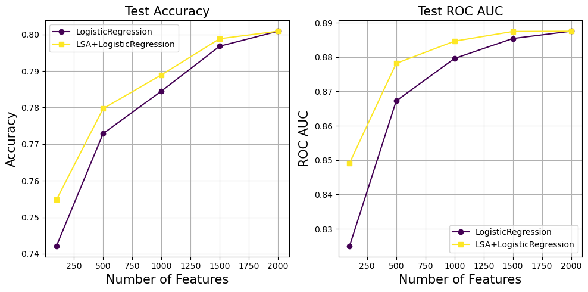

# LatentToken

This repository explores improving tokenization in Natural Language Processing (NLP) using Latent Semantic Analysis (LSA).

## Directory Structure

- `src/`: Contains all main scripts (preprocessing, model, evaluation).
- `notebooks/`: Jupyter notebooks for development, testing, and visualization.
- `plots/`: Stores plots.

## Sentiment Analysis

  

  

